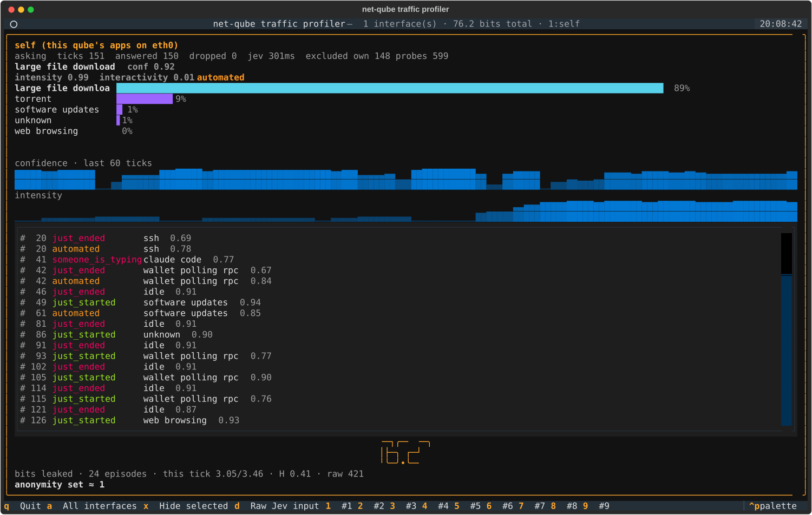

# jev-netprofiler

Shows what a network gateway can tell about you from traffic *shape* alone.

It watches the network interfaces of a Qubes OS net-qube, turns each ten
seconds of flow metadata into a short text made only of level words (no
addresses, ports, sizes or timestamps), asks TypeSafe's Jev model which
activity from a small catalog that shape looks like, and displays the answer
in a terminal UI with a running count of identifying bits. Jev never sees a
number; all arithmetic is local Python.



## Target environment

- A Qubes OS qube with `provides_network=True` (a net-qube): every downstream
  qube's `vif*` interface gets a pane. The qube's own applications can be
  profiled too (self mode, on `eth0`), with the profiler's own traffic left
  out.
- Any other Linux box in self mode: `netprofiler --self --self-iface <iface>`.
- Root is needed for packet capture. Python 3.11+ (template needs
  `python3-venv`, or `uv` in the qube). libpcap is bundled in the nfstream
  wheel.
- A TypeSafe API key (`TYPESAFE_API_KEY`).

## Install on a Qubes net-qube

1. In the template: `sudo apt install python3 python3-venv git`, shut it
   down, restart the net-qube. (Alternative without touching the template:
   `curl -LsSf https://astral.sh/uv/install.sh | sh` inside the qube.)
2. In the qube:
   ```sh
   git clone https://github.com/SCBuergel/jev-netprofiler.git
   cd jev-netprofiler
   echo 'TYPESAFE_API_KEY=...' > .env
   sudo ./install.sh
   ```
   This puts everything under `/rw/config/netprofiler`, starts a systemd
   service (`--headless --self`), and hooks `/rw/config/rc.local` so it
   survives reboots. `SELF=0 sudo ./install.sh` skips self mode.
3. Watch it:
   ```sh
   sudo /rw/config/netprofiler/venv/bin/netprofiler --attach /run/netprofiler/state.json
   ```
   Panes appear as soon as a qube using this one as NetVM starts.

## Activities

idle, unknown, web browsing, ssh, software updates, chat, wallet polling
rpc, torrent, large file upload, large file download, claude code.

Edit `activities.yaml` to change them (name plus a one-line shape
description, up to 255 entries).

## Terminal UI

One pane per interface: current activity with confidence, top-five bar
chart, sparklines of confidence and intensity over the last 60 ticks, an
event log (`just_started`, `just_ended`, `automated`, `someone_is_typing`),
the bits-leaked counter and the anonymity set it implies.

Keys: `1`..`9` show only that interface, `x` hide the selected one, `a` show
all, `d` toggle a panel with the exact `state` sent to Jev for the selected
pane, `q` quit. The questions are static; `netprofiler --dump-questions`
prints them.

## Run by hand

```sh
uv venv .venv && uv pip install -p .venv/bin/python -e '.[dev]'
export TYPESAFE_API_KEY=...

sudo -E .venv/bin/netprofiler                    # net-qube mode, TUI
sudo -E .venv/bin/netprofiler --self             # plus this qube's own apps
.venv/bin/netprofiler --pcap file.pcap --speed 2 # replay a capture offline
.venv/bin/netprofiler --headless --show-shape --pcap file.pcap --dry-run   # no API calls
.venv/bin/pytest
```

`--include-own-traffic` keeps the profiler's own Jev calls in the self pane
(they read as `wallet polling rpc`, which is the point of excluding them).
`--self-iface` picks the interface for self mode (default `eth0`).
`--local-net CIDR` sets which side of a flow is the downstream qube when the
SYN direction and private/public split cannot tell. `--no-heartbeat` stops
the one-packet-per-second multicast keepalive that lets nfstream expire idle
flows on a silent vif.

## How it works

Every 2 s per interface: nfstream flow segments from the last 10 s are
reduced to statistics (flows, endpoints, direction, bursts and gaps, packet
sizes, spacing, transport, trend), each mapped to a word, rendered into
about 700 tokens of prose with a guard against digits. Burst start times are also kept for a
minute per interface so the text can say whether bursts come at a regular
or a human-looking rhythm over a longer horizon than one window. One Jev
call fans out a Choice over the catalog, Scores for intensity and
interactivity, and four Nouls. One call in flight per interface; a tick arriving while one is
outstanding is dropped. Shannon entropy of the Choice distribution gives
bits = log2(N) - H; bits accumulate once per activity episode (episodes
follow the 4-tick smoothed top answer); anonymity set = population / 2^bits.

## Raw-packet mode (experimental, this branch)

`--raw` replaces the reduced description with a filtered packet log.
`tcpdump -nn -tt -q -l -s 96` records headers only (payload is never
captured), one line per packet; every `--raw-batch` seconds (default 5) the
batch is encoded and sent as the state. Columns kept: time (as the delay
since the previous line), flow id, direction, payload length; a flow table
gives protocol, an opaque endpoint id and the port. Remote addresses never
leave the process. Pure TCP acks are counted per flow rather than listed,
and one computed summary line gives flow, endpoint, packet, byte and pause
counts. The text is kept under `--raw-budget` tokens (default 12000) by a
ladder: verbatim lines, then run-length encoding of identical packets, then
100 ms and 500 ms per-flow bins, then truncation.

Jev tokenizes these digit-heavy lines at about one token per character, so
a verbatim line costs ~11 tokens. Measured on the same server and
scenarios, shape mode costs ~1,970 tokens per call every 2 s (about 1,000
tok/s); raw mode averaged 500 tok/s with 5 s batches and 390 tok/s with 10 s
batches (idle batches cost ~1,700 tokens, bulk transfers collapse to bins
at ~3,000), peaking at 10,600 (5 s) and 16,800 (10 s) tokens in one call.
So it is cheaper, not more expensive.

Accuracy is where it loses. On the same scenarios, bulk transfers are
recognised as well as in shape mode (large file download 0.98, large file
upload 0.98), but everything low-volume and interactive gets worse: web
browsing reads as `claude code`, wallet polling as `unknown` or `claude
code`, ssh typing as `unknown`, `chat` or `claude code`, where shape mode
scored 0.8 to 0.9 on each. Longer batches did not help (10 s made browsing,
wallet and ssh all read as `claude code`). Jev appears to key on gross
features of the raw log (several flows, small packets, pauses) and does not
recover rhythm, keystroke cadence or burst structure from hundreds of
numeric lines the way the reducer's level words state them outright. The
reduced description remains the better input; the raw path is kept on this
branch as an experiment.

## Local test rig

`tools/fake_qube.py` plays a downstream qube on a veth pair (`vif99.0` on
the host, `qube0` in a network namespace) with scripted scenarios; the
docstring has the setup and teardown commands.

## What it gets right, and not

Tested on a public Ubuntu server in self mode with real traffic: web
browsing 0.9, large file download 0.99, large file upload 0.99, ssh with
`someone_is_typing` 0.8, wallet polling an RPC 0.9 (once a minute of rhythm
has built up), torrent 0.98 at first and then alternating with large file
download as the client settles on one fast peer, software updates recognised
at the start and then read as a large download once the sustained fetch
dominates. Chat (IRC, a line every few seconds) is the weak spot: one tiny
burst every few seconds on one flow looks the same as a polling wallet at
this granularity, and it mostly reads as `wallet polling rpc`. Claude Code
is in the catalog but was not tested on the server.

Unsolicited inbound noise on a public address (port scans answered with a
reset, unanswered UDP, pings) is filtered before the window; a Qubes qube
behind NAT never sees it.

## Limits

- nfstream expires idle flows only when a packet arrives on the interface;
  the heartbeat exists for that. The window ends 2.25 s behind the present
  because the newest segment of an ongoing flow is still inside nfstream.
- Burst structure is estimated from 2 s flow segments; sub-segment timing
  comes only from each segment's first ten packets.
- The profiler's own DNS lookups are not excluded from the self pane (one
  per new connection, tiny).
- Level thresholds in `netprofiler/levels.py` were set by hand.
